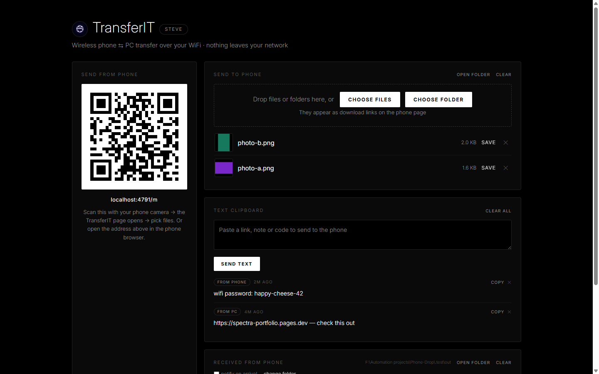

# TransferIT

**Free phone ⇄ PC file transfer over your WiFi.**
No install · No cloud · Nothing leaves your network

**[⬇ Download TransferIT.zip (latest)](../../releases/latest)**

## How it works

1. Run `TransferIT.exe` (no installation) on your Windows 10/11 PC.
2. First run only: Windows shows "unknown publisher" → click **More info → Run anyway**, then **Allow** on the firewall prompt (normal for unsigned independent apps).
3. A page opens with a QR code. Scan it with your phone (same WiFi) and send files instantly, both directions.

## Features

- Phone → PC and PC → phone
- Live progress bar, speed and time remaining
- Photo thumbnails and download links on the phone page
- Interrupted transfers resume automatically
- Sound + Windows notification when files arrive
- Pick exactly where received files are saved
- Temporary private QR: every launch creates a fresh code, old links die
- Single portable exe — copy it anywhere, share it with friends

## Privacy

Everything is device-to-device over your local network. Nothing is uploaded to the internet, ever.

## Requirements

- Windows 10 or 11
- Phone and PC on the same WiFi network

---

Built by Shanto Ahmed · [Behance](https://www.behance.net/shantoahmed0) · [Portfolio](https://spectra-portfolio.pages.dev)
